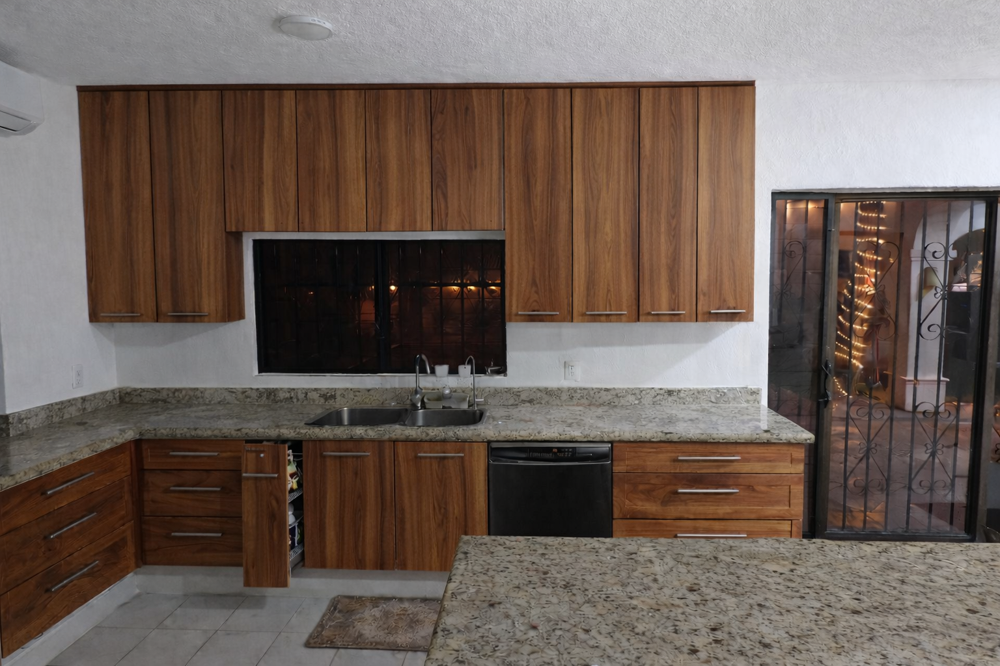

# Continuous Base Cabinetry

## Overview

This section spans two walls and provides continuous base cabinetry with integrated sink, dishwasher, and storage.

### Dimensions
- Height: Standard counter height (TBD)
- Depth: Standard base cabinet depth (TBD)
- Total run: TBD mm (spanning two walls)

### Materials and finish
- **Solid Pirota wood**, dark natural tone
- Flat, modern, handleless fronts
- Consistent with tall cabinetry aesthetic

### Hardware
- Soft-close hardware throughout
- Hinges and runners suitable for humid tropical conditions

---

## Subsections

*To be documented:*
- Sink section with specifications
- Dishwasher integration
- Base storage cabinets
- Countertop specifications
- Backsplash details
- Electrical outlets
- Plumbing rough-in locations
